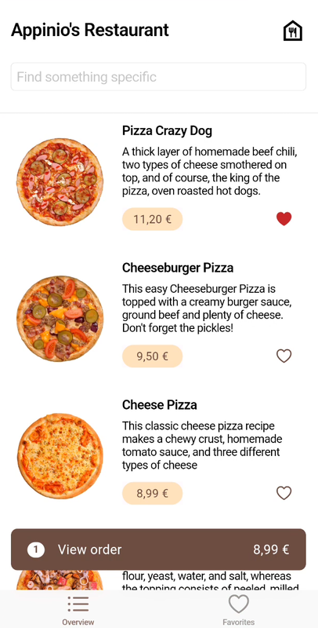

# Appinio Home Test
[](https://festelo.github.io/appinio-home-test/)
[](https://github.com/festelo/appinio-home-test/releases)



## Project structure

* `lib/ui` - contains Flutter widgets, routes, pages and all the code responsible for the appearance.
  + `pages` - contains pages (incl. bottom sheets) of the app. A typical page includes:
    + `page` - the view itself
    + `cubit` - logic of this UI
    + `view_model` - a store of UI-related data
  + `extensions` - extensions for things related to the UI, such as formatting strings for display.
  + `widgets` - common reusable widgets
  + `theme.dart` - a collection of colors and textstyles of the app (all colors and styles are supposed to be placed here, in theory)
* `lib/domain` - this module **should** contain the business logic of the app. However, to save some time and because the app contains minimal logic, it mainly acts as a barrier or an abstraction  between "data" and "ui" worlds.
  + `repositories` - contains interfaces of repositories, contracts that can be used by UI and should be implemented in Data.
  + `model` - contains business entities with which repositories operate
  + `extensions` - extensions on models, some simple logic
* `lib/data` - takes care of communicating with the 'outer world' and interacts with third party libraries. Databases, REST, etc. 
  + `repositories` - implementations of repositories defined in 'domain'
  + `dto` - internal models with which repositories operate inside the 'data' level
  + `firestore_collections` - definitions of firestore collections (collection names and list of their fields)
  + `mappers` - mappers from DTOs to 'domain' entities
* `localization` - contains .arb files for localization

## Tests

Currently, there is only one test, which serves as an example. However, it's possible to write tests for any part of the app (including golden image tests).  
The test is written for basket_address_cubit and covers two cases: cubit loading and street changing.  
[Link to the test](test/ui/pages/basket_sheet/basket_address_page/basket_address_cubit_test.dart)  


## CI/CD

The project uses Github Actions for CI/CD, with two jobs executed upon pushes to the 'main' branch:

* The `android` job builds the android apk and publishes it in the `releases` section.
* The `web` job builds web application and deploys it to the `gh-pages` branch, which is used for github pages.

## Databases

As per the requirements, Firestore is used to store food, and favorites are also stored there. The food in the basket is stored in-memory.  

* `food` - a collection with food items
  + `name`
  + `description` 
  + `imageUrl`
  + `price` (EUR only, string)
* `favorites` - a collection of users' favorite dishes
  + `foodId`
  + `userId`- since there is no authorization, `userId` always remains the same.
* `orders`
  + `street`
  + `floor`
  + `comment`
  + `userId`
  + `food`
    + `foodId`
    + `count`

## Firestore rules

There are Firestore security rules to enhance the app's security. Ideally, these rules would compare `userId` from db entities with the current user's id. However, since the app lacks authentication, they instead compare against a constant value. In this implementation it doesn't provide real security benefits (except for the few cases), but can be an example of how it could be implemented

```
rules_version = '2';

service cloud.firestore {
  match /databases/{database}/documents {
    match /food/{document=**} {
      allow read;
    }
    match /orders/{document=**} {
      allow create: if request.resource.data.userId == 'the-only-one';
    }
    match /favorites/{document=**} {
      allow read: if resource.data.userId == 'the-only-one';
      allow create: if request.resource.data.userId == 'the-only-one';
      allow delete: if resource.data.userId == 'the-only-one';
    }
  }
}
```

## Notes

* The `firebase_options.dart` file is included ([it's safe](https://firebase.google.com/docs/projects/api-keys#api-keys-for-firebase-are-different)), so it should be possible to build the repo without any changes (clone & build).
* The search bar searches not only in food titles, but also in their description.
* I decided not to implement pagination, as restaurants typically have only a few menu items, which can be easily loaded without it.
* **Localization** is implemented, with only two strings as examples; all other text remains hardcoded
* There is no error handling in case of poor or no internet connection.
* Pull-to-refresh is available on the main page